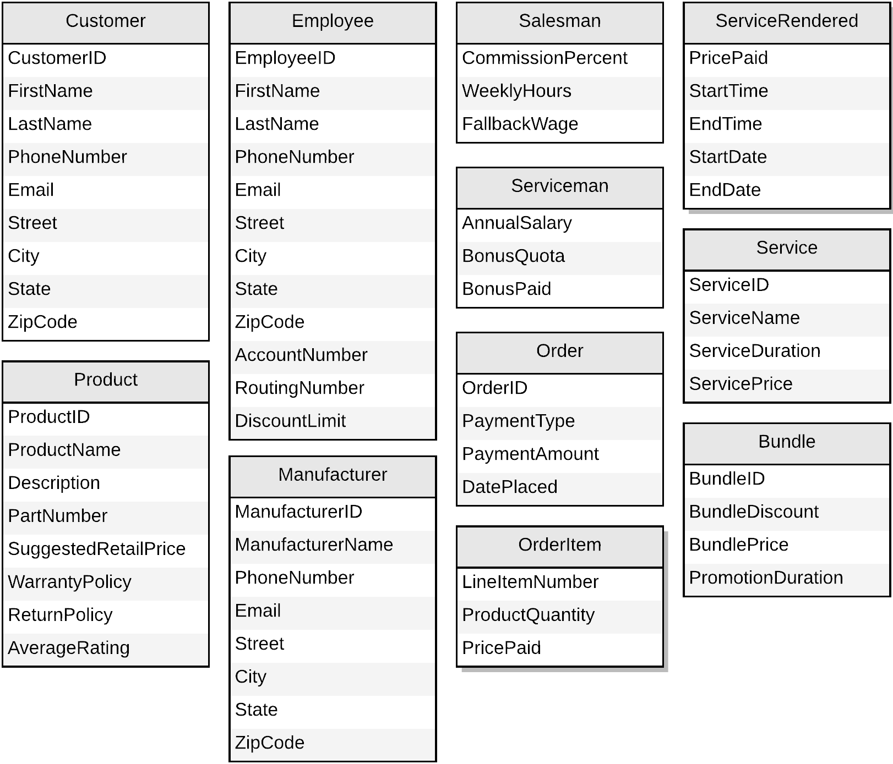
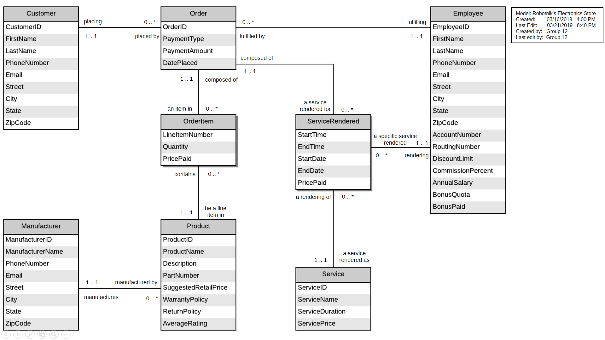
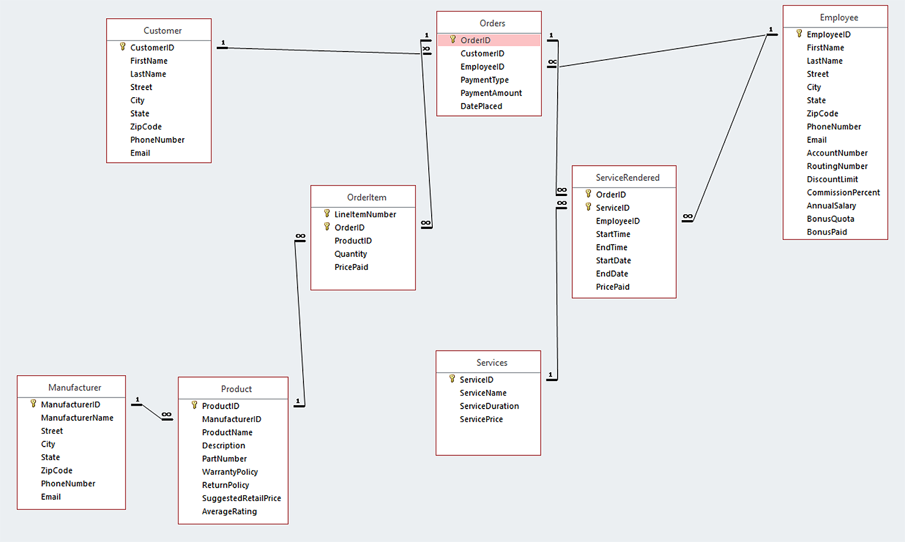

# Robotniks Inc. Access Database
### This database design project was created for the CIS 3400 class (section EMWA) of Spring 2019 at CUNY - Baruch College. This project involves the development of a business scenario necessating the creation of a new database, a database design custom-fitted to the hypothetical business, and the development of a prototype in SQL and Microsoft Access.

---
## Business Scenario Proposal
* Robotniks Inc. is a brick-and-mortar multi-purpose computer enterprise that began as a small computer repair business in 2002. With the advent of smartphones and the integration of computers into the daily lives of consumers and businesses alike, the company has experienced steady growth in parallel with the technological advances of the era. In order to accommodate the needs consumers, the company has pivoted from being a simple family-owned repair store to a center for all computer-related needs.

* While the company offers a multitude of options for consumers, the largest segment of its revenues is derived from product sales. Individual components, discounted bundles, pre-built desktops, laptops, and associated peripherals comprise the stock available at any Robotniks location. The manufacturer part number, contact information, and warranty policy for each item is required along with the item specifications and an average user rating from 1-5. Customers are free to browse and purchase any item(s) at their leisure, but salesmen are available to answer any questions, make recommendations, and connect customers to services provided by the store that may be useful after they have made their purchase(s). Sales representatives are hourly workers with a commission-based pay or a fixed fallback wage, whichever is the higher of the two.

* The next largest segment is composed of the services that the company was originally founded upon. Experts are available to repair all products available for sale in the store as well as smartphones. In addition to hardware repairs, experts provide assistance and advice with software issues, including malware, data recovery, boot failures and crashes, and failed product installations. Servicemen may also build desktops and servers for customers from a selection of components provided by the customer. These experts are salaried and may receive an annual bonus based on quotas and customer feedback.

* For all transactions, whether they be product purchases or service fulfillments, the information of the customer and the employee involved must be recorded. For customers, the full name, email, phone number, and address are required. Payment method, and payment amount, the items or services ordered, and optional feedback about the involved employee may be included dependent on the details of the transaction. For employees, the full name, email, phone number, address, bank information are required. Employees can make purchases at a discounted rate with a limit of two discounted items per month.

## Initial List of Entities


---
## Relational Model
    Manufacturer (ManufacturerID (key), ManufacturerName, PhoneNumber, Email, Street, City, State, ZipCode)

    Service (ServiceID (key), ServiceName, ServiceDuration, ServicePrice)

    Employee (EmployeeID (key), FirstName, LastName, PhoneNumber, Email, Street, City, State, ZipCode, AccountNumber, RoutingNumber, DiscountLimit, CommissionPercent, AnnualSalary, BonusQuota, BonusPaid)

    Customer (CustomerID (key), FirstName, LastName, PhoneNumber, Email, Street, City, State, ZipCode)

    Order (OrderID (key), CustomerID (fk), EmployeeID (fk), PaymentType, PaymentAmount, DatePlaced)

    OrderItem (LineItemNumber (key), OrderID (fk), ProductID (fk), Quantity, PricePaid)

    ServiceRendered (OrderID (key) (fk), ServiceID (key) (fk), EmployeeID (fk), StartTime, EndTime, StartDate, EndDate, PricePaid)

    Product (ProductID (key), ManufacturerID (fk), ProductName, Description, PartNumber, SuggestedRetailPrice, WarrantyPolicy, ReturnPolicy, AverageRating)

## Normalization
```
Manufacturer (ManufacturerID (key), ManufacturerName, PhoneNumber, Email, Street, City, State, ZipCode)
Key: ManufacturerID
FD1: ManufacturerID → ManufacturerName, PhoneNumber, Email, Street, City, State, ZipCode
FD2: ZipCode → City, State

1NF: Yes, because it meets the definition of a relation.
2NF: Yes, because there are no partial key dependencies.
3NF: No, because FD2 is a transitive dependency.
Solution: Split Manufacturer into two new relations, remove City and State from Manufacturer, and copy ZipCode.

Zip (ZipCode (key), City, State)
Key: ZipCode
FD1: ZipCode → City, State

Manufacturer2 (ManufacturerID (key), ZipCode (fk), ManufacturerName, PhoneNumber, Email, Street)
Key: ManufacturerID
FD1: ManufacturerID → ZipCode, ManufacturerName, PhoneNumber, Email, Street

The two resulting relations are now in 3NF because there are no transitive dependencies.
```

```
Employee (EmployeeID (key), FirstName, LastName, PhoneNumber, Email, Street, City, State, ZipCode, AccountNumber, RoutingNumber, DiscountLimit, CommissionPercent, AnnualSalary, BonusQuota, BonusPaid)
Key: EmployeeID
FD1: EmployeeID → FirstName, LastName, PhoneNumber, Email, Street, City, State, ZipCode, AccountNumber, RoutingNumber, DiscountLimit, CommissionPercent, AnnualSalary, BonusQuota, BonusPaid
FD2: ZipCode → City, State

1NF: Yes, because it is a relation with a key.
2NF: Yes, because there are no partial key dependencies.
3NF: No, because FD2 is a transitive dependency.
Solution: Split Employee into two new relations, remove City and State from Employee, and copy ZipCode.

Zip (ZipCode (key), City, State)
Key: ZipCode
FD1: ZipCode → City, State

Employee2 (EmployeeID (key), ZipCode (fk), FirstName, LastName, PhoneNumber, Email, Street, AccountNumber, RoutingNumber, DiscountLimit, CommissionPercent, AnnualSalary, BonusQuota, BonusPaid)
Key: EmployeeID
FD1: EmployeeID → ZipCode (fk), FirstName, LastName, PhoneNumber, Email, Street, AccountNumber, RoutingNumber, DiscountLimit, CommissionPercent, AnnualSalary, BonusQuota, BonusPaid

The two resulting relations are now in 3NF because there are no transitive dependencies.
```

```
Customer (CustomerID (key), FirstName, LastName, PhoneNumber, Email, Street, City, State, ZipCode)
Key: CustomerID
FD1: CustomerID → FirstName, LastName, PhoneNumber, Email, Street, City, State, ZipCode
FD2: ZipCode → City, State

1NF: Yes, because it is a relation with a key.
2NF: Yes, because there are no partial key dependencies.
3NF: No, because FD2 is a transitive dependency.
Solution: Split Customer into two new relations, remove City and State, and copy ZipCode.

Zip (ZipCode (key), City, State)
Key: ZipCode
FD1: ZipCode → City, State

Customer2 (CustomerID (key), ZipCode (fk), FirstName, LastName, PhoneNumber, Email, Street)
Key: CustomerID
FD1: CustomerID → ZipCode (fk), FirstName, LastName, PhoneNumber, Email, Street

The two resulting relations are now in 3NF because there are no transitive dependencies.
```

```
Order (OrderID (key), CustomerID (fk), EmployeeID (fk), PaymentType, PaymentAmount, DatePlaced)
Key: OrderID
FD1: OrderID → CustomerID (fk), EmployeeID (fk), PaymentType, PaymentAmount, DatePlaced

1NF: Yes, because it is a relation with a key.
2NF: Yes, because there are no partial key dependencies.
3NF: Yes, because there are no transitive dependencies.
```

```
OrderItem (LineItemNumber (key), OrderID (key) (fk), ProductID (fk), Quantity, PricePaid)
Key: LineItemNumber, OrderID
FD1: LineItemNumber (key), OrderID (key) (fk) → ProductID (fk), Quantity, PricePaid

1NF: Yes, because it is a relation with a key.
2NF: Yes, because there are no partial key dependencies.
3NF: Yes, because there are no transitive dependencies.
```

```
Service (ServiceID (key), ServiceName, ServiceDuration, ServicePrice)
Key: ServiceID
FD1: ServiceID → ServiceName, ServiceDuration, ServicePrice

1NF: Yes, because it is a relation with a key.
2NF: Yes, because there are no partial key dependencies.
3NF: Yes, because there are no transitive dependencies.
```

```
ServiceRendered (OrderID (key) (fk), ServiceID (key) (fk), EmployeeID (fk), StartTime, EndTime, StartDate, EndDate, PricePaid)
Key: OrderID, ServiceID
FD1: OrderID (key) (fk), ServiceID (key) (fk) → EmployeeID (fk), StartTime, EndTime, StartDate, EndDate, PricePaid

1NF: Yes, because it is a relation with a key.
2NF: Yes, because there are no partial key dependencies.
3NF: Yes, because there are no transitive dependencies.
```

```
Product (ProductID (key) , ManufacturerID (fk), ProductName, Description, PartNumber, SuggestedRetailPrice, WarrantyPolicy, ReturnPolicy, AverageRating)
Key: ProductID
FD1: ProductID (key) → ManufacturerID (fk), ProductName, Description, PartNumber, SuggestedRetailPrice, WarrantyPolicy, ReturnPolicy, AverageRating

1NF: Yes, because it is a relation with a key.
2NF: Yes, because there are no partial key dependencies.
3NF: Yes, because there are no transitive dependencies.
```

## Final Set of Relations
**NOTE:** In order to make the database easier to implement, we are choosing to de-normalize the Zip relation and the associated relations as the small number of records does not necessitate it.

```
Manufacturer (ManufacturerID (key), ManufacturerName, ZipCode, City, State, Street, PhoneNumber, Email)

Service (ServiceID (key), ServiceName, ServiceDuration, ServicePrice)

Employee (EmployeeID (key), FirstName, LastName, PhoneNumber, Email, ZipCode, City, State, Street, AccountNumber, RoutingNumber, DiscountLimit, CommissionPercent, AnnualSalary, BonusQuota, BonusPaid)

Customer (CustomerID (key), FirstName, LastName, PhoneNumber, Email, ZipCode, City, State, Street)

Order (OrderID (key), CustomerID (fk), EmployeeID (fk), PaymentType, PaymentAmount, DatePlaced)

OrderItem (LineItemNumber (key), OrderID (key) (fk), ProductID (fk), Quantity, PricePaid)

ServiceRendered (OrderID (key) (fk), ServiceID (key) (fk), EmployeeID (fk), StartTime, EndTime, StartDate, EndDate, PricePaid)

Product (ProductID (key), ManufacturerID (fk), ProductName, Description, PartNumber, SuggestedRetailPrice, WarrantyPolicy, ReturnPolicy, AverageRating)
```

---
## Entity-Relationship Model


## Relationship View in Microsoft Access
